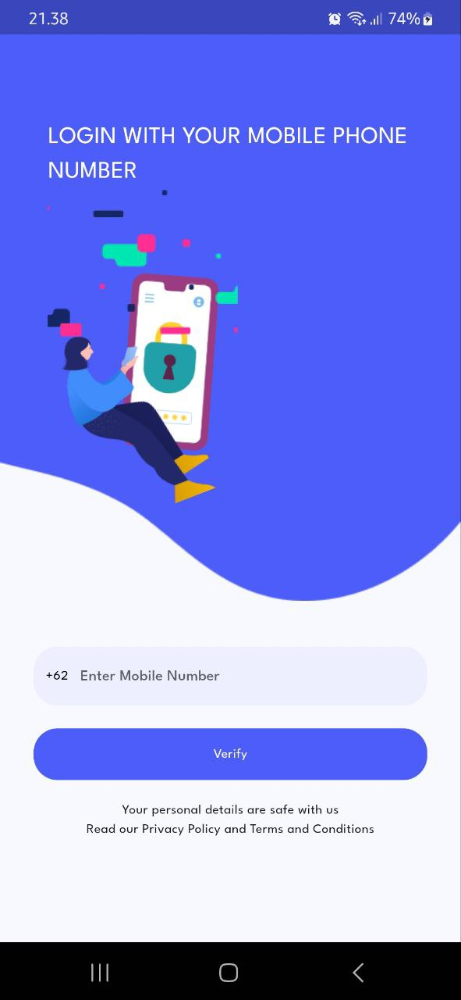
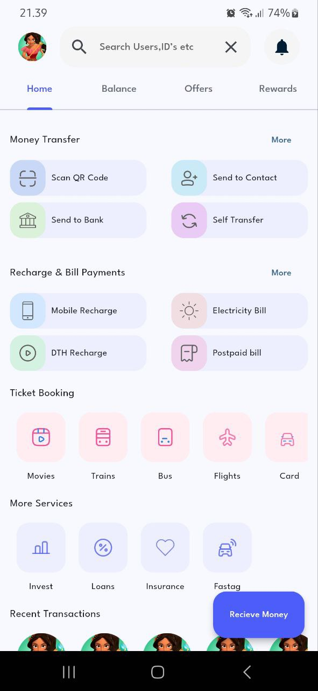
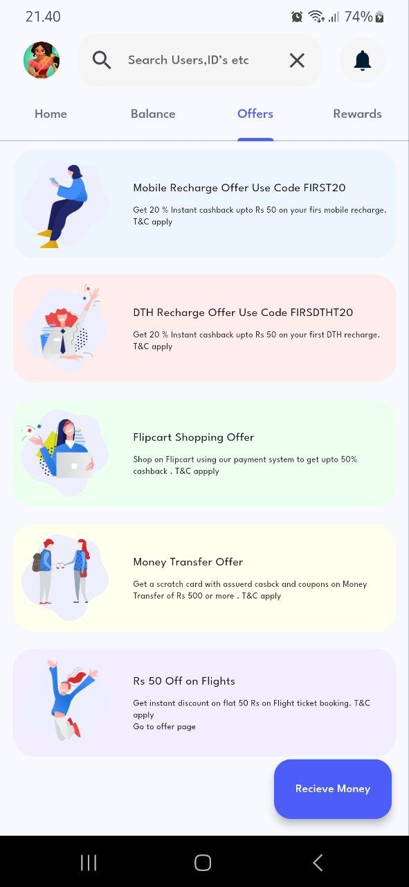
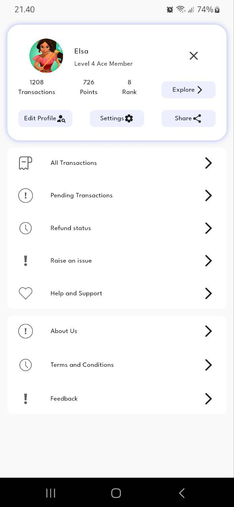

# Instant Pay Mobile Payment App

This project is a mobile application UI built using Flutter. The design is sliced from a Figma template and adapted to the Flutter environment. The UI focuses on a sleek and modern payment app interface.

## 🎨 UI Design Reference

The design was inspired by a Figma community template. You can view the original design here:

[Instant Pay Mobile Payment App UI Design on Figma](https://www.figma.com/community/file/1102179157650176081/instant-pay-mobile-payment-app-ui-design)

## 🛠️ Getting Started

To run this project on your local device, follow these steps:

### Prerequisites

Ensure you have the following installed on your system:

- Flutter SDK version 3.4.3
- A code editor like VS Code or Android Studio
- Git

### Installation

1. Clone the repository:

    ```bash
    git clone https://github.com/muuri19/Instant-Pay-Mobile-Payment-App.git
    ```

2. Navigate to the project directory:

    ```bash
    cd Instant-Pay-Mobile-Payment-App
    ```

3. Install the necessary dependencies:

    ```bash
    flutter pub get
    ```

### Running the App

1. Connect your device or start an emulator.
2. Run the app:

    ```bash
    flutter run
    ```

## 📦 Dependencies

This project relies on the following major packages (as referenced in the `pubspec.yaml` file):

- `flutter: ^3.4.3`
- `google_fonts: ^6.2.1`

You can find the full list of dependencies in the `pubspec.yaml` file.

## 🚀 Features

- Modern mobile payment UI
- Cross-platform compatibility

## 📚 Resources

- [Flutter Documentation](https://flutter.dev/docs)
- [Figma Design](https://www.figma.com/community/file/1102179157650176081/instant-pay-mobile-payment-app-ui-design)

## 📷 Documentation

Here are some screenshots from the app:

<p align="center">
  
  
</p>
<p align="center">
  
  
</p>

## 🤝 Contributing

Feel free to fork this repository, create a branch, make changes, and submit a pull request. Any contributions are highly appreciated!

## 📜 License

This project is licensed under the MIT License - see the [LICENSE](LICENSE) file for details.

---

Developed by [Muhammad Sadri](https://github.com/muuri19) with 💙 and Flutter.
